# Tarea 3 Análisis de Algoritmos
**Autores:** Santiago Martínez, Pablo Ortega, Estefanía Laverde (201922512)
## Ejercicio 1 
**Enunciado**: Generar aleatoriamente y visualizar en Cytoscape grafos, simples, conexos y planares con diferentes números de vértices y ejes. La cantidad de vértices en todos los casos debe ser mayor o igual a 20.

Se crean los siguientes grafos aleatorios planos y se grafican planarmente usando Cytoscape. 
- Grafo de 20 vértices y 35 aristas:
  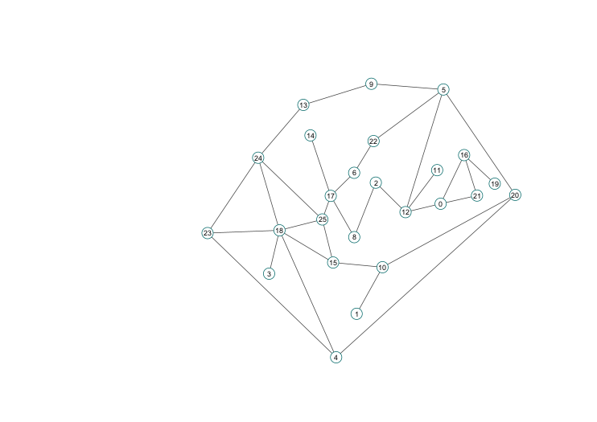
- Grafo de 42 vértices y 48 aristas:
  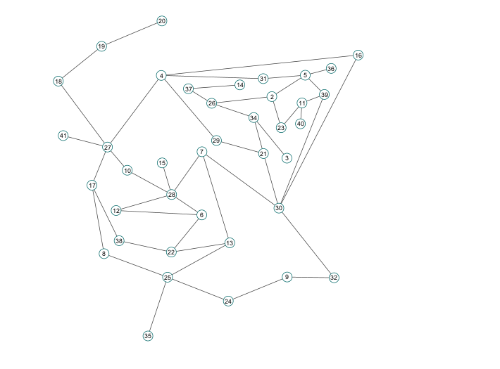
- Grafo de 25 vertices y 43 aristas:
  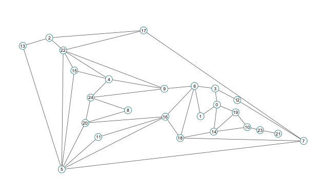
- Grafo de 32 vertices y 39 aristas:
  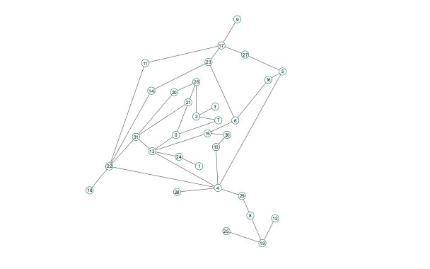
- Grafo de 30 vertices y 50 aristas:
  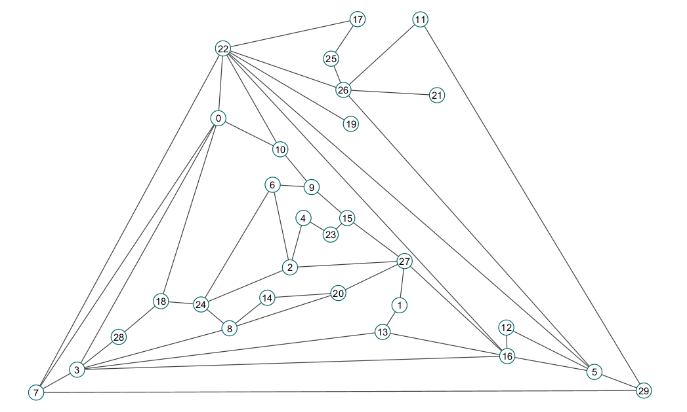
- Grafo de 20 vertices y 30 aristas:
  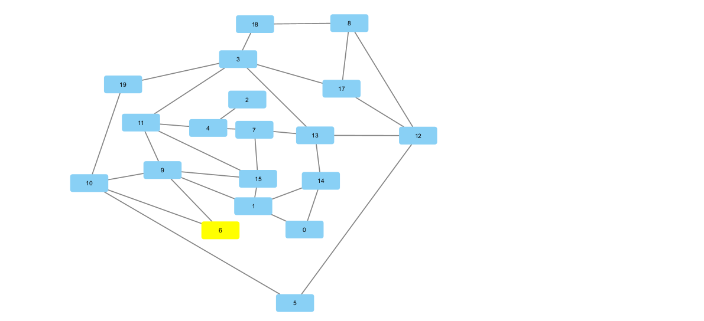
- Grafo de 20 vertices y 35 aristas:
  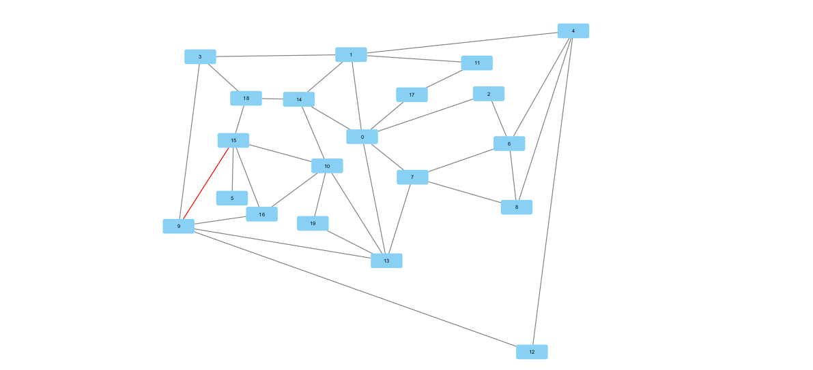
  <!-- TODO: terminar de colocar los ejemplos -->

## Ejercicio 2
**Enunciado**: De acuerdo con los experimentos, para un grafo de 20 vértices, desde qué cantidad de ejes aleatorios es poco probable generar un grafo planar?. Cómo se compara esto con el límite teórico dado por |E|<= 3|V| - 6

<!-- TODO: explicar experimentos y mostrar resultados -->

## Ejercicio 3
**Enunciado**: Diseñar un grafo planar de 20 o más vértices que tenga al menos 2|V| ejes.

Se realiza la implementación de un algoritmo que crea a partir de un número de vertices un grafo plano. Dicho algoritmo parte de 3 vertices iniciales cuyos ejes forman un triangulo, y añadiendo vertices sucesivos separando una región de un triangulo en tres nuevas regiones. El proceso descrito permite añadir vertices sin que se crucen aristas, asegurando que el grafo siempre sea plano. Un ejemplificación del proceso se encuentra en las siguientes imagenes. 

- Iniciación:
    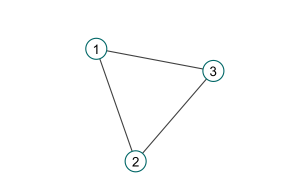

- Nuevo vértice
    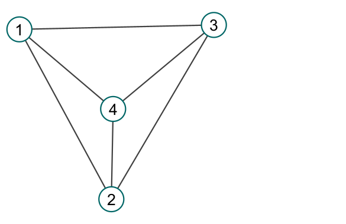
  
- Siguiente vértice
    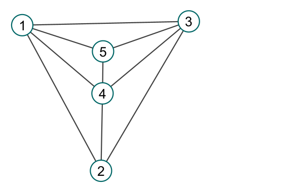

### Número de aristas
Haciendo uso de la construcción planteada, los primeros tres vértices tienen tres aristas, y al añadir un nuevo vértice se añaden tres aristas nuevas. De esta manera podemos llegar a que el número de aristas es
$$|E|=3+(n-3)*3 = 3(n-2)$$
Siendo $n$ el número de vértices.

Demostremos ahora que para cualquier $n\geq20$ se cumple que $|E|\geq2n$ por inducción.

- Caso base: sea $n=20$, note que 
$$|E| = 3(20-2) = 54 \geq 2\cdot20 = 40$$
- Caso inductivo: sea $n>20$ y supongamos que $|E|\geq2n$. 
  
  Se quiere mostrar que para $n+1$ $|E'|\geq2n$, siendo $|E'|$ el número de aristas añadiendo un vértice.
  Note que por construcción, al añadir un nuevo vértice tendremos que $|E'|=|E|+3$. Por hipótesis de inducción, $|E'|=|E|+3 \geq2n+3\geq2n$ al ser $n$ un entero mayor a 20, concluyendo así que $|E'|\geq2n$.

### Ejemplo con Cytoscape
A continuación se muestra un grafo de 20 vértices y 54 aristas planar construido con el algoritmo planteado.
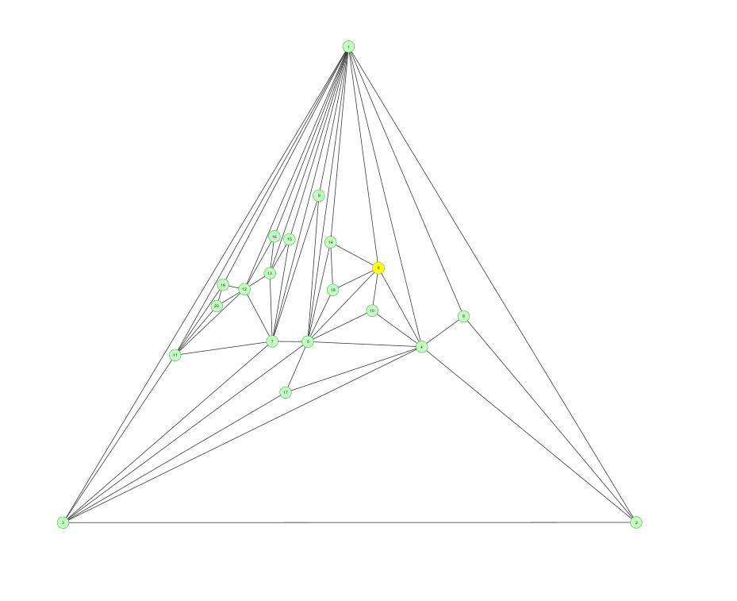