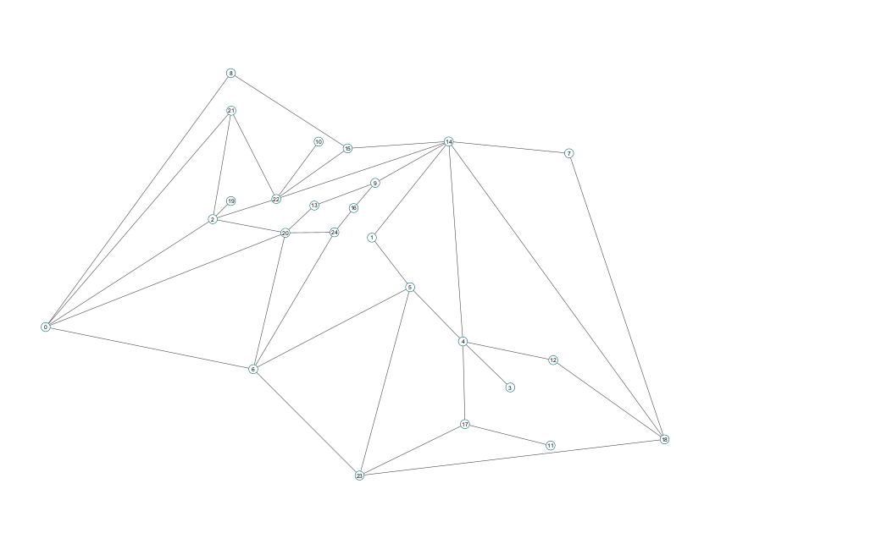

# Tarea 3 Análisis de Algoritmos
<<<<<<< HEAD
**Autores:** Santiago Martínez, Pablo Ortega, Estefanía Laverde (201922512)
=======
**Autores:** Santiago Martínez - 202510729, Pablo Ortega - 202021700, Estefanía Laverde - 201922512
>>>>>>> 679c6c1fdb40bec556d242011766d8b1b964d10c
## Ejercicio 1 
**Enunciado**: Generar aleatoriamente y visualizar en Cytoscape grafos, simples, conexos y planares con diferentes números de vértices y ejes. La cantidad de vértices en todos los casos debe ser mayor o igual a 20.

Se crean los siguientes grafos aleatorios planos y se grafican planarmente usando Cytoscape. 
- Grafo de 20 vértices y 35 aristas:
  
- Grafo de 42 vértices y 48 aristas:
  
- Grafo de 25 vertices y 43 aristas:
  
- Grafo de 32 vertices y 39 aristas:
  
<<<<<<< HEAD
- Grafo de 30 vertices y 50 aristas:
  
- Grafo de 20 vertices y 30 aristas:
  
- Grafo de 20 vertices y 35 aristas:
  
=======
  - Grafo de 25 vertices y 40 aristas:
  
    - Grafo de 25 vertices y 69 aristas:
  
      - Grafo de 35 vertices y 35 aristas:
  
        - Grafo de 20 vertices y 30 aristas:
  
          - Grafo de 30 vertices y 50 aristas:
  
            - Grafo de 40 vertices y 60 aristas:
  


>>>>>>> 679c6c1fdb40bec556d242011766d8b1b964d10c
  <!-- TODO: terminar de colocar los ejemplos -->

## Ejercicio 2
**Enunciado**: De acuerdo con los experimentos, para un grafo de 20 vértices, desde qué cantidad de ejes aleatorios es poco probable generar un grafo planar?. Cómo se compara esto con el límite teórico dado por |E|<= 3|V| - 6

```python
import random
import networkx as nx
import matplotlib.pyplot as plt
import itertools
import pandas as pd


def generate_edge(n):
    a=random.randint(0,n-1)
    b=random.randint(0,n-1)
    while a==b:
        b=random.randint(0,n-1)

    return (min(a,b),max(a,b))

def generate_edges(n,m):
    used_edges=set()

    m=min(m,(n*(n-1))//2)

    while len(used_edges)<m:
        a,b=generate_edge(n)
        if (a,b) not in used_edges:
            used_edges.add((a,b))
    
    return list(used_edges)

def generate_graph(n,m):
    G=nx.Graph()

    G.add_nodes_from(range(n))

    edges=generate_edges(n,m)
    G.add_edges_from(edges)

    return G


def planarity_experiment(n,attempts):
    max_edges=3*n-6
    probs=[]
    for edge_count in range(max_edges+1):
        planar_count=0
        for i in range(attempts):
            G=generate_graph(n,edge_count)
            planar_count+=nx.is_planar(G)

        probs.append(planar_count/attempts)

    return probs

def generate_planar_graph(n,m):
    G=generate_graph(n,m)

    while not nx.is_planar(G):
        G=generate_graph(n,m)
    
    return G


def save_graph_to_xlsx(G,output_path):
    df=pd.DataFrame(G.edges,columns=['node1','node2'])
    df.to_excel(output_path)

if __name__=='__main__':
    n=20
    max_edges=3*n-6
    attempts=1000

    probs=planarity_experiment(n,attempts)

    plt.plot(list(range(max_edges+1)),probs)
    plt.xlabel('number of edges')
    plt.ylabel('planarity probability')
    
    plt.savefig('planarity_experiment.png')
    #plt.show()
```


<!-- TODO: explicar experimentos y mostrar resultados -->
Se hace un script para generar grafos aleatorios con 20 nodos, cuya cantidad de ejes varia entre 0 y 54 (54=3*20-6 es el maximo de ejes posible para un grafo planar), los grafos generados se ponen en buckets dependiento de su cantidad de ejes y se usa la libreria networkx para determinar planaridad y asi contar la cantidad de grafos planares en cada bucket, con esto podemos aproximar la probabilidad de que un grafo aleatorio sea planar en funcion de la cantidad de ejes, para cada cantidad de ejes 0<=e<=54 se generan 1000 grafos con e ejes.


**Obervaciones**:

- La probabilidad de que el grafo sea planar es muy baja a partir del valor 40, a ojo se puede ver que cerca de este valor la curva es casi la recta constante 0.
- Se garantiza que la probabilidad es 0 para e>54
- Si bien todos los arboles de 20 nodos son planares y tienen 19 ejes, al generar un grafo aleatorio es posible que el grafo no sea conexo y por tanto no sea arbol, asi se tiene la posibilidad de que alguna de sus componentes conexas sea no planar y por tanto el grafo no sea planar, por esta razon la probabilidad de planaridad cerca de e=20 no es exactamente 1 aunque cercana.
- La curva parece ser aproximable por una funcion sigmoide.

## Ejercicio 3
**Enunciado**: Diseñar un grafo planar de 20 o más vértices que tenga al menos 2|V| ejes.

Se realiza la implementación de un algoritmo que crea a partir de un número de vertices un grafo plano. Dicho algoritmo parte de 3 vertices iniciales cuyos ejes forman un triangulo, y añadiendo vertices sucesivos separando una región de un triangulo en tres nuevas regiones. El proceso descrito permite añadir vertices sin que se crucen aristas, asegurando que el grafo siempre sea plano. 

```python
import pandas as pd
import random
import itertools

def create_random_graph(num_vertices:int, file_name:str) -> None:
    """
    Crea un grafo planar aleatorio con un número específico de vértices.
    
    El algoritmo inicia con un triángulo y va añadiendo vértices de forma iterativa,
    conectando cada nuevo vértice a los tres vértices de un triángulo existente elegido al azar. Este proceso garantiza que el grafo resultante sea planar.
    
    Args:
        num_vertices (int): Número de vértices que tendrá el grafo. Debe ser >= 3.
        file_name (str): Nombre del archivo CSV donde se guardará el grafo.
                        El archivo tendrá dos columnas: 'source' y 'target' 
                        representando los extremos de cada arista.
    
    Returns:
        None: El grafo se guarda en un archivo CSV.
    """
    
    triangles = [(1,2,3)]
    vertices = [1,2,3]

    while len(vertices) < num_vertices:
        triangle = random.choice(triangles)
        combinaciones = list(itertools.combinations(triangle, 2)) 

        # print(f'vertex f{len(vertices)+1} was added to triangle {triangle}')
        combinaciones = [comb+(len(vertices)+1,) for comb in combinaciones]
        triangles.remove(triangle)
        triangles += combinaciones 
        vertices.append(len(vertices)+1)


    edges = set()
    for tup in triangles:
        edges.update({(tup[i], tup[j]) for i in range(len(tup)) for j in range(i + 1, len(tup))})
    
    df = pd.DataFrame(list(edges), columns=['source', 'target'])
    df.to_csv(file_name, index=False)

```


Un ejemplificación del proceso se encuentra en las siguientes imagenes. 

- Iniciación:
    

- Nuevo vértice
    
  
- Siguiente vértice
    

### Número de aristas
Haciendo uso de la construcción planteada, los primeros tres vértices tienen tres aristas, y al añadir un nuevo vértice se añaden tres aristas nuevas. De esta manera podemos llegar a que el número de aristas es
$$|E|=3+(n-3)*3 = 3(n-2)$$
Siendo $n$ el número de vértices.

Demostremos ahora que para cualquier $n\geq20$ se cumple que $|E|\geq2n$ por inducción.

- Caso base: sea $n=20$, note que 
$$|E| = 3(20-2) = 54 \geq 2\cdot20 = 40$$
- Caso inductivo: sea $n>20$ y supongamos que $|E|\geq2n$. 
  
  Se quiere mostrar que para $n+1$ $|E'|\geq2n$, siendo $|E'|$ el número de aristas añadiendo un vértice.
  Note que por construcción, al añadir un nuevo vértice tendremos que $|E'|=|E|+3$. Por hipótesis de inducción, $|E'|=|E|+3 \geq2n+3\geq2n$ al ser $n$ un entero mayor a 20, concluyendo así que $|E'|\geq2n$.

### Ejemplo con Cytoscape
A continuación se muestra un grafo de 20 vértices y 54 aristas planar construido con el algoritmo planteado.
