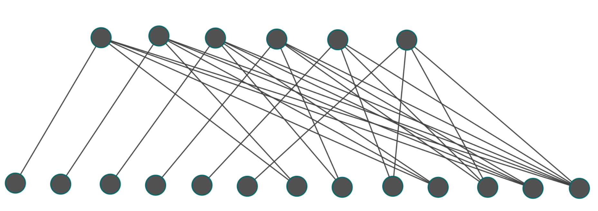

# Tarea 6 Análisis de Algoritmos
**Autores:** Santiago Martínez - 202510729, Pablo Ortega - 202021700, Estefanía Laverde - 201922512

# Instrucciones de uso

Se implementan los cucatro algoritmos de cubrimiento de vértices en los archivos `eje1.py`, `eje2.py`, `eje3.py` y `eje4.py` respectivamente. Se consolidan en el archivo `program.py`. Este programa recibe un archivo de texto con los ejes del grafo y un número que indique el algoritmo a ejecutar (entre 1 y 4). A continuación se enseña un ejemplo de archivo de entrada.

```bash
1	2
3	2
2   4
```

Para correr el programa se debe ejecutar el siguiente comando:

```bash
python program.py test_file.txt número
```
Siendo `test_file.txt` el archivo de entrada con las especificaciones mencionadas anteriormente y `número` un valor entero entre 1 y 4 para usar el algoritmo deseado.

# Experimento
Para probar los algoritmos se realizaron pruebas con grafos de diferente número de vértices y ejes. Se utilizó un multiplicador para probar grafos con 100, 1000 y 10000 vértices con diferentes cantidades de ejes determinadas por los multiplicadores 10, 50 y 100 de la cantidad de vértices.

|   Vertices |   Multiplicador |   Edges | Algorithm   |   Cover Size |    Time (s) |
|-----------:|----------------:|--------:|:------------|-------------:|------------:|
|        100 |              10 |    1000 | Alg.1       |           96 | 0.00100207  |
|        100 |              10 |    1000 | Alg.2       |           85 | 0.000998497 |
|        100 |              10 |    1000 | Alg.3       |           85 | 0.00196886  |
|        100 |              10 |    1000 | Alg.4       |           90 | 0.000998259 |
|        100 |              50 |    5000 | Alg.1       |          100 | 0.00500083  |
|        100 |              50 |    5000 | Alg.2       |           99 | 0.00599766  |
|        100 |              50 |    5000 | Alg.3       |           99 | 0.00600147  |
|        100 |              50 |    5000 | Alg.4       |           99 | 0.00896811  |
|        100 |             100 |   10000 | Alg.1       |          100 | 0.00500059  |
|        100 |             100 |   10000 | Alg.2       |           99 | 0.00500298  |
|        100 |             100 |   10000 | Alg.3       |           99 | 0.00499749  |
|        100 |             100 |   10000 | Alg.4       |           99 | 0.00900149  |
|       1000 |              10 |   10000 | Alg.1       |          952 | 0.0100012   |
|       1000 |              10 |   10000 | Alg.2       |          825 | 0.0150011   |
|       1000 |              10 |   10000 | Alg.3       |          832 | 0.0154893   |
|       1000 |              10 |   10000 | Alg.4       |          914 | 0.0211451   |
|       1000 |              50 |   50000 | Alg.1       |          990 | 0.0707479   |
|       1000 |              50 |   50000 | Alg.2       |          952 | 0.0784247   |
|       1000 |              50 |   50000 | Alg.3       |          960 | 0.0872383   |
|       1000 |              50 |   50000 | Alg.4       |          982 | 0.128361    |
|       1000 |             100 |  100000 | Alg.1       |          996 | 0.155003    |
|       1000 |             100 |  100000 | Alg.2       |          974 | 0.162249    |
|       1000 |             100 |  100000 | Alg.3       |          980 | 0.182155    |
|       1000 |             100 |  100000 | Alg.4       |          991 | 0.265393    |
|      10000 |              10 |  100000 | Alg.1       |         9558 | 0.195857    |
|      10000 |              10 |  100000 | Alg.2       |         8222 | 0.222579    |
|      10000 |              10 |  100000 | Alg.3       |         8358 | 0.225096    |
|      10000 |              10 |  100000 | Alg.4       |         9085 | 0.36697     |
|      10000 |              50 |  500000 | Alg.1       |         9900 | 1.22789     |
|      10000 |              50 |  500000 | Alg.2       |         9495 | 1.1913      |
|      10000 |              10 |  100000 | Alg.1       |         9558 | 0.195857    |
|      10000 |              10 |  100000 | Alg.2       |         8222 | 0.222579    |
|      10000 |              10 |  100000 | Alg.3       |         8358 | 0.225096    |
|      10000 |              10 |  100000 | Alg.4       |         9085 | 0.36697     |
|      10000 |              50 |  500000 | Alg.1       |         9900 | 1.22789     |
|      10000 |              10 |  100000 | Alg.1       |         9558 | 0.195857    |
|      10000 |              10 |  100000 | Alg.2       |         8222 | 0.222579    |
|      10000 |              10 |  100000 | Alg.3       |         8358 | 0.225096    |
|      10000 |              10 |  100000 | Alg.4       |         9085 | 0.36697     |
|      10000 |              10 |  100000 | Alg.1       |         9558 | 0.195857    |
|      10000 |              10 |  100000 | Alg.2       |         8222 | 0.222579    |
|      10000 |              10 |  100000 | Alg.3       |         8358 | 0.225096    |
|      10000 |              10 |  100000 | Alg.1       |         9558 | 0.195857    |
|      10000 |              10 |  100000 | Alg.2       |         8222 | 0.222579    |
|      10000 |              10 |  100000 | Alg.1       |         9558 | 0.195857    |
|      10000 |              10 |  100000 | Alg.1       |         9558 | 0.195857    |
|      10000 |              10 |  100000 | Alg.1       |         9558 | 0.195857    |
|      10000 |              10 |  100000 | Alg.1       |         9558 | 0.195857    |
|      10000 |              10 |  100000 | Alg.2       |         8222 | 0.222579    |
|      10000 |              10 |  100000 | Alg.3       |         8358 | 0.225096    |
|      10000 |              10 |  100000 | Alg.4       |         9085 | 0.36697     |
|      10000 |              50 |  500000 | Alg.1       |         9900 | 1.22789     |
|      10000 |              50 |  500000 | Alg.2       |         9495 | 1.1913      |
|      10000 |              50 |  500000 | Alg.3       |         9567 | 1.33518     |
|      10000 |              50 |  500000 | Alg.4       |         9810 | 1.90141     |
|      10000 |             100 | 1000000 | Alg.1       |         9952 | 2.23952     |
|      10000 |             100 | 1000000 | Alg.2       |         9723 | 2.36599     |
|      10000 |             100 | 1000000 | Alg.3       |         9764 | 2.62977     |
|      10000 |             100 | 1000000 | Alg.4       |         9909 | 3.81254     |


# Casos en los que los algoritmos 2 y 3 la solución es peor que 2 veces el número de vértices óptimo.
En la imagen se muestra un grafo bipartito con dos conjuntos de vértices: uno superior con 6 vértices y otro inferior con 13 vértices. La cobertura mínima de vértices en este grafo está compuesta por los 6 vértices del conjunto superior, ya que cada arista puede ser cubierta seleccionando únicamente estos vértices. Esta es la solución óptima. Sin embargo, al aplicar el algoritmo 2, se seleccionará primero el vértice del conjunto inferior que tiene grado 6. Luego, al eliminar sus aristas y continuar el proceso se seguirán eligiendo vértices del conjunto inferior, ya sea porque estos mantienen grados más altos que el conjunto superior o en caso de empate de grados considerando la opción del vértice inferior como el peor de los casos. Como resultado, el algoritmo termina seleccionando los 13 vértices del conjunto inferior, lo cual constituye una solución significativamente peor que la óptima. La razón entre el tamaño de esta solución y el tamaño de la solución óptima es de 13/6 > 2.

De manera similar, el algoritmo 3 también puede conducir a la misma solución si en algún paso se elige una arista conectada al vértice de grado 6 del conjunto inferior. Una vez incluido este vértice en la cobertura, muchas aristas se eliminan en la parte superior, lo cual causa que se elijan nuevamente los vertices de abajo en cascada. Y en este caso también tendriamos una razón de 13/6 > 2.

